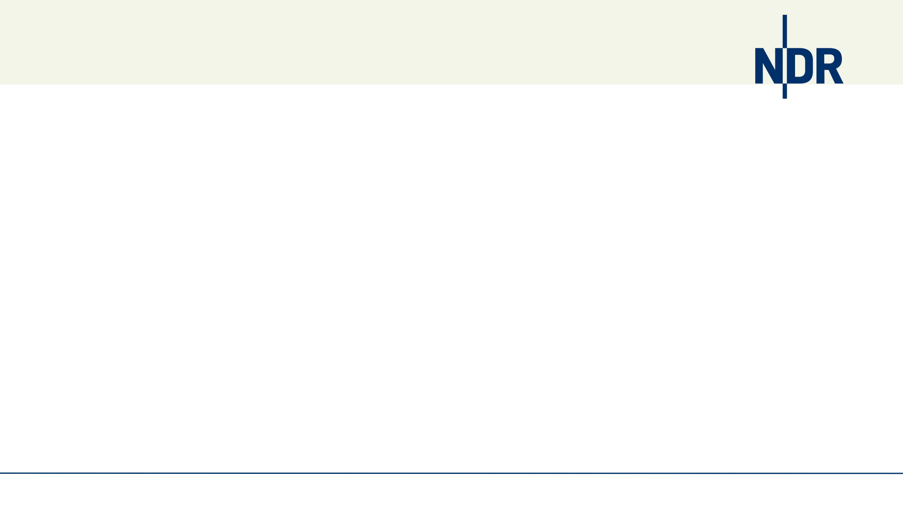
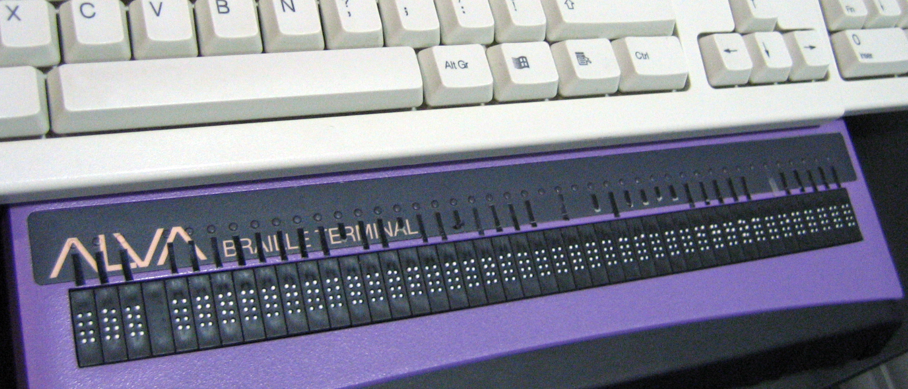
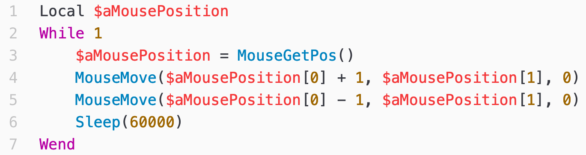

= ViDur - Mit dem Nachtzug durch Neuland
Conrad Zelck <c.zelck@ndr.de>
v1.0, 2019-12-08
:homepage: https://github.com/SimpelMe/ViDur---Mit-dem-Nachtzug-durch-Neuland
:notitle: true
// :nofooter:
:icons: font
:stylesheet: ./style/style-ndr.css
:pdf-theme: ./style/theme-ndr.yml
:listing-caption: Listing
:pdf-fontsdir: ./font
:page-background-image: 
// :linkcss:
:experimental:
// include::attributes-de.adoc[]
:tab: &nbsp;&nbsp;&nbsp;&nbsp;
:2sp: &nbsp;&nbsp;

[s20]#&nbsp;# +
[s6]#&nbsp;# +
[bigtitle]#ViDur - Mit dem Nachtzug durch Neuland#

[abstract]

[s80]#”# Wenn Dich dasselbe Problem regelmäßig ärgert, +
{2sp}{2sp}{2sp} dann nimm Dir die Zeit, es zu lösen. +
[.text-right]
[s14]#_—Sascha Molina_# +
[s12]#_Mitarbeitergespräch_#

<<<

== Reisefieber

(C) 2005 Matthieu Faure, bearbeitet{2sp}image:icon/CC-BY-SA.svg[title_"CC-BY-SA", pdfwidth=60px, width=60]

<<<

[discrete.hide-in-pdf]
== Reisefieber
* seit 1991: täglich morgens 1h first / second / third level support
* Spielplatz:
** AUTOEXEC.BAT, CONFIG.SYS
** QBasic:
*** Pferderennen
*** Mondlandung
*** Textverarbeitungsprogramm
* 1997 - 2000 Ausbildung Mediengestalter Bild und Ton
* 1998: eigener PC 386, 20 MB Festplatte für 50DM, Windows 3.11
* 2004: PowerBook G4 12" Combo, 60GB Festplatte, Mac OS X Panther 10.3

[discrete.hide-in-pdf]
== Reisefieber
* 2009: erstes Skript auf NDR-Client - ShakeMouse.exe

<<<

== Schlafwagen
_ViDur_ unterstützt bei der Kalkulation der Transcodingzeiten für Ingestaufträge mit  ~300 Zeilen Code.

image:images/ViDur.png[title="Screenshot ViDur", pdfwidth=18.0cm]

<<<

== „Ist noch ein Platz frei?”
[cols="3"]
[frame=none]
[grid=none]
|===
|&nbsp;
|&nbsp;
|&nbsp;
|
|image:images/cell_1.jpg[title="Was ich erklärte", 140]
|image:images/cell_3.jpg[title="Was der Tester dachte", 140]
|Was ich programmierte.
|Was ich erklärte.
|Was der Tester dachte.
|===
[discrete.hide-in-pdf]
(C) http://www.projectcartoon.com/about, bearbeitet{2sp}image:icon/CC-BY.svg[title_"CC-BY", pdfwidth=60px, width=60]

<<<

[discrete.hide-in-pdf]
== „Ist noch ein Platz frei?”
[cols="3"]
[frame=none]
[grid=none]
|===
|&nbsp;
|&nbsp;
|&nbsp;
|image:images/cell_4.jpg[title="Was der Tester erhielt", 140]
|image:images/cell_5.jpg[title="Was der Nutzer brauchte", 140]
|
|Was der Tester erhielt.
|Was der Nutzer brauchte.
|Wie es heute funktioniert.
|===
(C) http://www.projectcartoon.com/about, bearbeitet{2sp}image:icon/CC-BY.svg[title_"CC-BY", pdfwidth=60px, width=60]

<<<

[discrete.hide-in-pdf]
== „Ist noch ein Platz frei?”
* Das Tool wird immer anders bedient, als Du denkst!
** drag&drop und sendto vs. Doppelklick
* Soll ich wirklich einen Link auf dem Desktop und dem "Senden an"-Ordner anlegen?
* Versteckte Dateien, System Volume-Ordner und Mülleimer ($recycle / recycled) ignorieren!
* Lauflänge verifizieren; ist sie plausibel
** MP3 nicht prüfbar (oft Cover-Bild enthalten)
* LowRes-Dateien ignorieren
** Ini-Datei vs. hard coded
* Ergebnis-Ansicht: Gesamtlänge, geprüfte Files, gescheiterte Files, ignorierte Files
* Ignorierte Files explizit prüfen

== Hp0
[cols="30,70"]
[frame=none]
[grid=none]
|===
|
a|&nbsp; +
MediaInfo.dll

* Doku zur DLL nicht verstanden
** ein Beispiel: copy&paste
** 3-einhalb Jahre später Erleuchtung
*** 400% Geschwindigkeit
* DLL aktuell halten
* DLL wieder aufräumen
|===

<<<

== Reiseblog
Dokumentation

* für's Personal
** Kommentare deutsch / englisch
** sprechende Variablen
** 200 Zeilen main(), 100 Zeilen Funktionen
** Parameter "--extract|--extrakt|--source|--quelle|--code|--au3" Quellcode extrahieren
* für Fahrgäste
** ReleaseNotes.txt
*** mittlerweile: aus git log befüllbar
** GitHub README.md (noch unzureichend) und GitHub Issues

<<<

== „Ist hier ein Arzt an Bord?”

* offensichtlicher Kontakt in der GUI
* Fehlermeldungen meist über VPN-Forum
* 8 (14) Rechner von Hand ausrollen
* niemals am Freitag ausrollen
* ~100 Zeilen ViDur-Updater
* Automatisierung möglich?
* statt *.NeuNEUneuFinal Versionierung über git

<<<

== „Kann ich auf ihrem Ticket mitfahren?”
[source]
----
Am: November 2018

Lieber Conrad Zelck,

auf Hinweis von _____ _____ habe ich mich bei unseren Entwicklern erkundigt, ob/welche Erfahrungen und Hinweise sie dazu haben. Ergebnis: Das war bisher bei uns nicht Thema, weil alle davon ausgehen, dass (von uns für den NDR) erstellter Code dem NDR gehört und auch nicht veröffentlicht werden sollte. […]
----

<<<

== „Die Fahrscheine bitte!”
[source]
----
Am: Dezember 2018

Moin,

Bin jetzt auch nicht so der Lizenzkenner, aber MIT ist sicher nicht verkehrt, […]
----
* 
* https://github.com/NorddeutscherRundfunk/ViDur
* oxford:/opt/git/abf-tools.git/ViDur.git
* MediaInfo.dll: ähnlich CC-BY
* App-Icon: CC0 Public Domain Licence - Free for personal use only

<<<

== „Pass- und Zollkontrolle!”
* Projektinformationsforum für Mitbestimmung (kleine oder große Rundfahrt):
** Personalrat
** IT-Sicherheit
** Datenschutz
** Barrierefreiheit
** Gesundheitsschutz
** Arbeitssicherheit
* Softwareverzeichnis

<<<

[cols="^"]
[frame=none]
[grid=none]
|===
|[s40]#&nbsp;#
|[thanks]#Vielen Dank#
|
|
| {2sp}

{homepage}
|
|
|
|===

[s24]#&nbsp;# +
_[s12]#Version {revnumber} | {revdate} | made with asciidoctor {asciidoctor-version} and asciidoctor-pdf 1.5.0.beta.5#_
